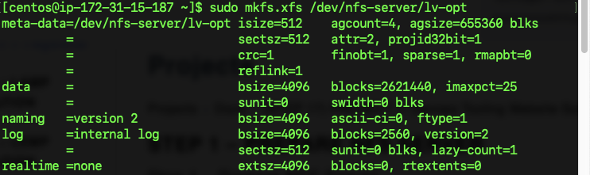

## DEVOPS TOOLING WEBSITE SOLUTION

This project entails the use of DevOps tools that will help team in day to day activities. In this project I will implement a solution that consists of the following components.  

1. Infrastructure : AWS
2. Webserver Linux: RHEL 8
3. Database Server: Ubuntu 20.04
4. Programming Lang: PHP
5. Storage Server: RHEL 8

### Preparing NFS Server
The first I did was to spin up an EC2 instance and configure the Storage server using the LVM(Logical Volume Management). I created 3 volumes which are 
lv-apps , lv-logs, ls-opt which will be used by the web-servers, web-servers logs and web-server for jenkins.

The second step is to make directories in /mnt directory in RHEL8 filesystem 

`sudo mkdir apps logs opt`

The next step is to mount each of the logical volumes created(lv-apps , lv-logs, ls-opt) to each of these directories (apps logs opt)
 

### Preparing NFS Server